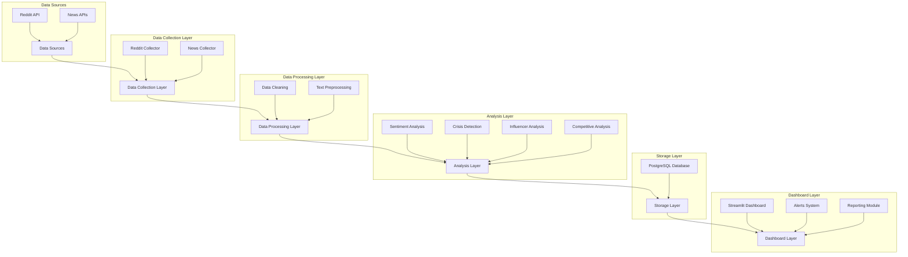
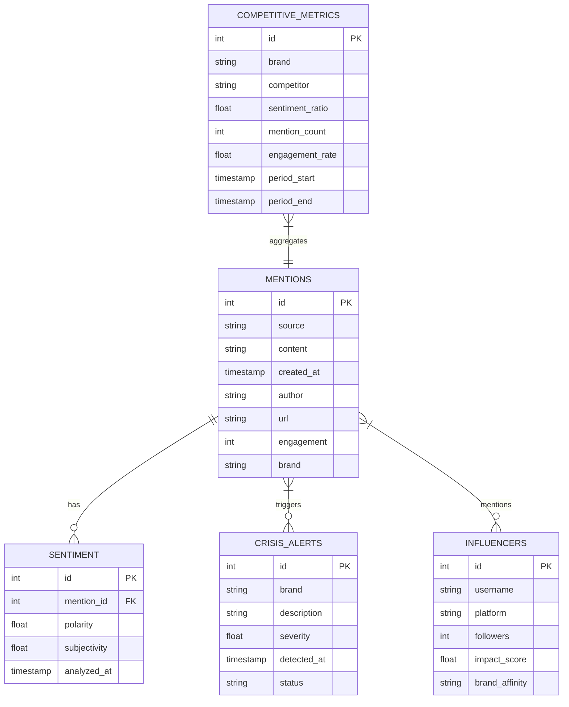

# Social Media Brand Monitoring & Crisis Detection System Architecture

## System Overview

This system monitors social media platforms and news sources to track brand mentions, analyze sentiment, detect potential crises, and provide actionable insights through an interactive dashboard.

## Technology Stack

- **Programming Language**: Python
- **Dashboard Framework**: Streamlit
- **Database**: PostgreSQL
- **Data Sources**: Reddit API, News APIs
- **Key Libraries**:
  - PRAW (Python Reddit API Wrapper)
  - Requests (for News APIs)
  - pandas (data manipulation)
  - NLTK/TextBlob/spaCy (NLP and sentiment analysis)
  - SQLAlchemy (database ORM)
  - Plotly/Matplotlib (data visualization)
  - psycopg2 (PostgreSQL connector)

## System Architecture

## Component Details

### 1. Data Collection Layer

Responsible for fetching data from various sources:

- **Reddit Collector**: Uses PRAW to fetch posts, comments, and metadata from relevant subreddits
- **News Collector**: Connects to News APIs to fetch articles and media mentions

### 2. Data Processing Layer

Prepares raw data for analysis:

- **Data Cleaning**: Removes duplicates, handles missing values, standardizes formats
- **Text Preprocessing**: Tokenization, stopword removal, lemmatization for text analysis

### 3. Analysis Layer

Performs various analyses on the processed data:

- **Sentiment Analysis**: Determines sentiment polarity and subjectivity of mentions
- **Crisis Detection**: Identifies potential PR crises based on sentiment shifts and volume spikes
- **Influencer Analysis**: Identifies key opinion leaders and measures their impact
- **Competitive Analysis**: Benchmarks against competitors' social media presence

### 4. Storage Layer

Manages data persistence:

- **PostgreSQL Database**: Stores structured data with proper relationships
  - Mentions table
  - Sentiment scores
  - Crisis alerts
  - Influencer profiles
  - Competitive metrics

### 5. Dashboard Layer

Presents insights and enables interaction:

- **Streamlit Dashboard**: Interactive visualization of key metrics and trends
- **Alerts System**: Real-time notifications of potential crises
- **Reporting Module**: Generates automated reports with actionable insights

## Database Schema

## Data Flow

1. Scheduled collectors fetch data from Reddit and News APIs
2. Raw data is cleaned and preprocessed
3. Analysis modules process the data to extract insights
4. Results are stored in the PostgreSQL database
5. Dashboard queries the database to display visualizations
6. Alert system monitors for crisis conditions and sends notifications
7. Reporting module generates periodic summaries

## Implementation Phases

### Phase 1: Setup & Data Connection
- Project structure setup
- API access configuration
- Database setup and schema creation
- Basic data collection implementation

### Phase 2: Processing & Analysis
- Data cleaning and preprocessing pipeline
- Sentiment analysis implementation
- Basic crisis detection algorithms
- Initial data visualization components

### Phase 3: Dashboard & Polish
- Streamlit dashboard development
- Advanced features (alerts, filtering)
- Automated reporting
- Documentation and deployment